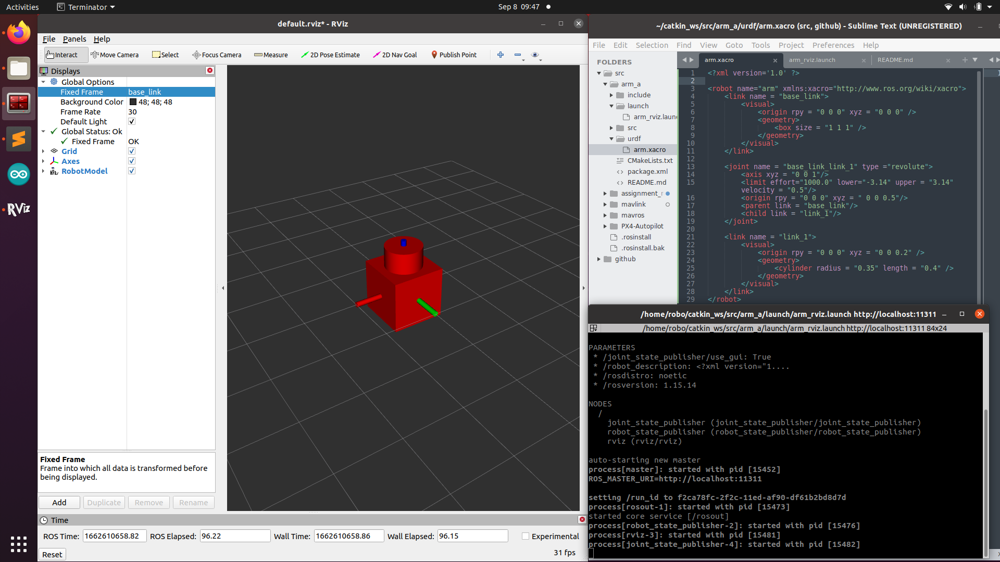
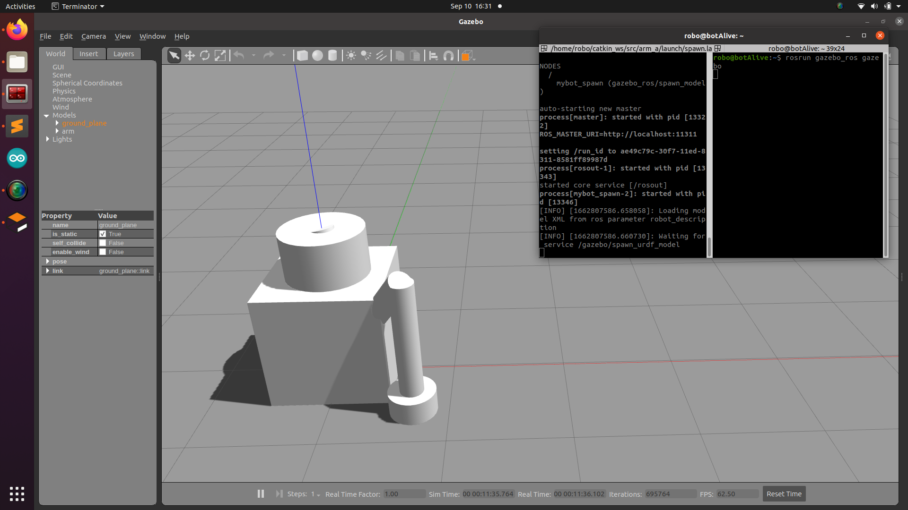

# Robot Manipulator
This Repository contains a robot manipulator from scratch.

---
### Change Logs :
#### 0.0.1
- Added the package in catkin_ ws with a package name arm_a
```
catkin_create_pkg arm_a roscpp rospy urdf
```
- Added a folder named urdf
- Added arm.xacro (xacro is xml macro)

#### 0.0.2
- Adding the links in xacro file
- started with the base link
- visual part contains collision, roll-pitch-yaw, inertia

#### 0.0.3
- Added the xacro file. 
- Added description of base link and link 1 along with there joints.
- Joints appear in the middle of links.
- Added a rviz launch file.
```
catkin build
roslaunch arm_a arm_rviz.launch
```
- Refer to the Video 1.

#### 0.0.4
- Saved the rviz configs in the launch folder as config.rviz 
- For showing the saved rviz config during roslaunch we have to add some lines in ros launch file
```
<node name="rviz" pkg="rviz" type="rviz" args=" -d $(find arm_a)/launch/config.rviz"/>
```
- After that :
```
roslaunch arm_a arm_rviz.launch
```

#### 0.0.5
- Added a xacro macro file named link_joint.xacro
- This file contains the links and joint definition as a function
- In arm_b.xacro we are just calling those function from the link_joint.xacro file and using them.
- Need to include this file in arm_b.xacro
```
<xacro:include filename = "$(find arm_a)/urdf/link_joint.xacro" />
```
- Made the file name change in the launch file.
- After that :
```
roslaunch arm_a arm_rviz.launch
```
- Refer to the Video 2.

#### 0.0.6
- Added a file named robot_parameters.xacro.
- this file contains the name of the links and joints as parameters.
- used "${link_name}" to get the link name from the xacro file.
- So if we need to change the name or the parameters we have to that in that specific file only.

#### 0.0.7
- Added the intertia and collision parameters in the xacro file
- inertia and collision properties depend on the robot model we are making.
- After that added a spawn.launch file to launch gazebo simulation.
- After that :
```
roslaunch arm_a spawn.launch
rosrun gazebo_ros gazebo
```
- Refer to Image 2.
- The links have fallen down because stil there is no controller initialized.

#### 0.0.8
- Kept only 3 links and 2 joints to apply controller.
- Added an allias in .bashrc and source .bashrc to kill th previous gzclient and gzserver since the model was not updating.
```
alias killg='killall gzclient && killall gzserver && killall rosmaster'
```
#### 0.0.9
- Added transmission in arm_b.xacro file for the joints to implement controllers.
- Made changes in the dependencies in CMakeLists.txt and package.xml
- Added dependencies of joint state publisher, robot state publisher, controller manager.
- Made changes in the spawn.launch file to include controller_manager
- Encapsulated launch file inside a group tag.
- Added joints.yaml in the config folder
- joints.yaml contains the controller properties and names.
- Added a gazebo plugin in arm_b.xacro file named gazebo_ros_control.
- After that :
```
roscore
rosrun gazebo_ros gazebo
roslaunch arm_a spawn.launch
rostopic list
rostopic pub -1 /arm/joint2_position_controller/command std_msgs/Float64 "data: 0.7"
rostopic pub -1 /arm/joint1_position_controller/command std_msgs/Float64 "data: 1"
```
- Refer to Video 3

#### 0.0.10
- Added transmission properties in link_joint.xacro file
- Added node for rqt
- Added transmission for all the other joints.
- Reduced the mass of the links and inertia.
- Added lower and upper limit of the robot movement.
- After that :
```
roscore
rosrun gazebo_ros gazebo
roslaunch arm_a spawn.launch
rostopic list
```
- Then use the rqt_publisher to give the values to links and plot juggler to view it.
- Refer to Video 4.

---
### Images :

#### Image 1 :


#### Image 2 :


### Vidoes :

#### Video 1 :
https://user-images.githubusercontent.com/56507553/189474051-e167d7de-ddbb-4ec2-9db9-4c5db68e6177.mp4

#### Video 2 :
https://user-images.githubusercontent.com/56507553/189452882-20b8ea90-231a-4d94-abcc-88aa335bc7a2.mp4

#### Video 3 :
https://user-images.githubusercontent.com/56507553/189517449-66ffbf97-fba4-4ae5-a48f-88f90b699c51.mp4

#### Video 4 :


